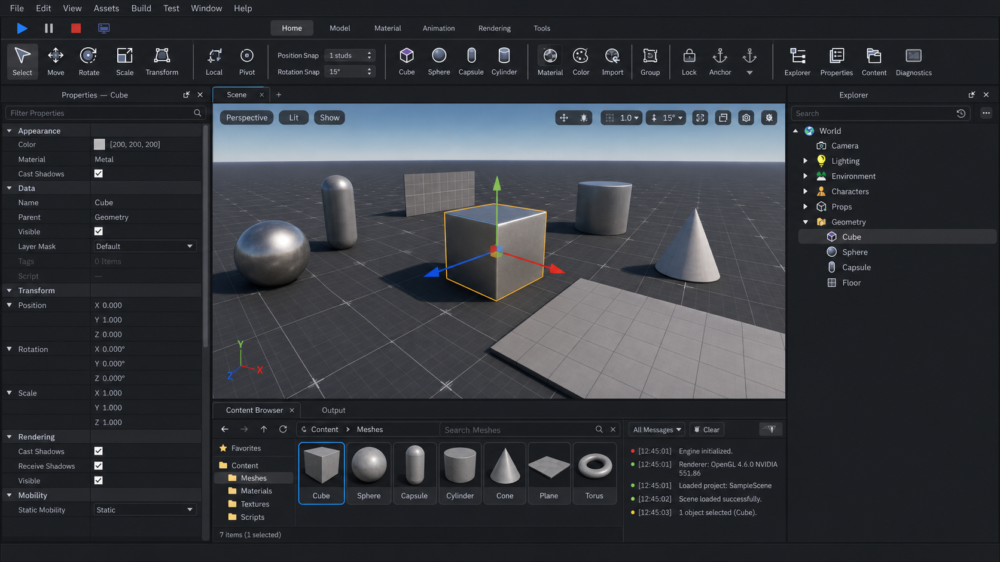

# Complete Editor Application Plan

## Status and Scope

This document is the authoritative implementation plan for the engine editor. The editor is a separate authoring application used before and while running the game. It is not an in-game overlay.

Implementation order is dependency order only. No feature listed here is deferred. The editor is complete only when every feature and verification criterion in this document passes.

The default dark layout is:

- A central world viewport.
- A docked Properties panel on the left.
- A docked World Explorer on the right.
- Menus and a command ribbon across the top.
- Dockable Content Browser, Output, diagnostics, and import panels along the bottom.
- Resizable, collapsible, closable, detachable, and restorable panels.

## Visual Design Contract

The rendered editor must follow the supplied references as a visual and interaction contract, not merely as a suggestion for panel placement. The consolidated target is:



The three supplied references have distinct authority:

- The Explorer reference defines the hierarchy tree, search bar, disclosure arrows, indentation, compact rows, type icons, selected-row treatment, title-bar controls, and panel density.
- The Properties reference defines the categorized two-column property grid, filtering, nested rows, checkboxes, color swatches, disabled values, separators, scroll behavior, and compact typography.
- The toolbar reference defines the menu bar, play controls, workspace tabs, grouped command ribbon, large labeled tool icons, snapping controls, separators, enabled/disabled states, and document tabs.

The default layout must preserve these proportions:

- A 26-30 pixel menu bar at the top.
- A 36-42 pixel play and workspace strip.
- A 90-110 pixel grouped command ribbon.
- A Properties panel occupying approximately 19-22% of the content width on the left.
- An Explorer panel occupying approximately 19-22% on the right.
- The viewport receiving all remaining central space and remaining the visually dominant region.
- A bottom dock occupying approximately 24-30% of the available content height when open.
- Visible 1-pixel splitters and generous draggable hit regions between docks.

The visual language is:

- Near-black charcoal application chrome and panel bodies, with slightly lighter title bars, category headers, controls, and selected rows.
- Off-white primary text, restrained gray secondary text, and limited blue, green, orange, purple, yellow, and red accents for semantic state and object types.
- Compact desktop-tool typography at approximately 12-14 pixels for panel content and 13-15 pixels for titles.
- Property and Explorer rows approximately 24-28 pixels high.
- Four-to-six-pixel control radii, one-pixel separators, and no glass, glow, oversized cards, excessive gradients, or sparse web-dashboard styling.
- Crisp original line icons with 16-20 pixel panel icons and 24-32 pixel ribbon icons.
- Hover, active, selected, disabled, focused, error, warning, and drag-target states defined for every interactive control.

The Properties panel defaults to `Properties — <Selection Name>` and contains:

- A full-width `Filter Properties` field immediately below the title bar.
- Collapsible `Appearance`, `Data`, `Transform`, `Rendering`, and `Mobility` categories.
- A strict two-column name/value grid with an adjustable divider.
- Nested position, rotation, scale, origin, and pivot rows.
- Inline checkboxes, swatches, numeric fields, enum selectors, asset references, and reset controls.
- Muted read-only or unavailable values without removing their structural context.

The Explorer panel defaults to `Explorer` and contains:

- A rounded search field with history and more-actions controls.
- A compact, indented object tree rooted at `World`.
- Distinct icons for cameras, lights, folders, meshes, materials, and other registered component/object categories.
- Rounded selected-row highlighting spanning the panel width.
- Precise disclosure arrows, hierarchy indentation, keyboard focus, and drag/drop insertion feedback.

The top interface contains:

- `File`, `Edit`, `View`, `Assets`, `Build`, `Test`, `Window`, and `Help` menus.
- Play, pause, stop, and standalone controls.
- `Home`, `Model`, `Material`, `Animation`, `Rendering`, and `Tools` workspaces.
- Grouped Select, Move, Rotate, Scale, Transform, coordinate-space, pivot, snapping, primitive, material, color, import, group, lock, anchor, and panel-visibility commands.
- Vertical separators between functional groups and visible labels beneath primary icons.

Visual acceptance requires screenshots at 1920x1080 and 2560x1440 to retain the same hierarchy, density, proportions, and panel construction as the target. Functional completeness without this visual fidelity does not satisfy the editor plan.

## Authorization Gates

Implementation must not begin until the user explicitly approves:

1. Vendoring a pinned Dear ImGui docking release.
2. Vendoring a pinned JSON serialization library for readable authoring files.
3. Splitting the solution into an Engine static library, Editor executable, and Game executable.

No dependency may be downloaded or installed without that approval.

## Solution Architecture

```text
OpenGL.sln
├── Engine    Existing engine systems compiled as a static library
├── Editor    World-authoring application
└── Game      Standalone game application
```

Existing engine sources remain under `OpenGL/src/` where practical. Application entry points and demonstration composition move into their owning executable without unrelated source relocation.

The primary ownership graph is:

```text
EditorApplication
├── EditorUIContext
│   ├── EditorDockspace
│   ├── EditorViewport
│   ├── WorldExplorerPanel
│   ├── PropertiesPanel
│   ├── ContentBrowserPanel
│   └── OutputPanel
└── EditorSession
    ├── Authoring Scene
    ├── Optional Play Scene
    ├── EditorSelection
    ├── EditorCommandRegistry
    ├── EditorTransactionStack
    └── EditorDocument
```

## 1. UI Foundation

Add the editor UI integration under:

```text
Editor/src/ui/
├── EditorUIContext.h/.cpp
├── EditorUIRenderer.h/.cpp
├── EditorDockspace.h/.cpp
├── EditorTheme.h/.cpp
├── EditorPanel.h
└── EditorLayoutStore.h/.cpp
```

Dear ImGui remains contained within the Editor target. Engine components, assets, scene classes, and renderer APIs must not depend on ImGui types.

`EditorUIRenderer` uses the engine `Device`, persistent vertex/index buffers, cached graphics state, scissor rectangles, texture handles, and fenced frame resources. `InputSystem` and `WindowManager` provide input and multi-window behavior; panels do not poll GLFW directly.

Required UI features:

- Persistent dock layouts and panel visibility.
- DPI-aware coordinates, fonts, icons, hit testing, and layout.
- Keyboard, mouse, controller, clipboard, drag/drop, and text input.
- Full keyboard navigation and configurable shortcuts.
- Dark theme matching the supplied references.
- Native-window detachment through the existing window abstraction.

## 2. Editor Session and Documents

Add:

```text
Editor/src/session/
├── EditorSession.h/.cpp
├── EditorDocument.h/.cpp
├── EditorSelection.h/.cpp
├── EditorPlayController.h/.cpp
├── EditorPreferences.h/.cpp
└── EditorRecoveryStore.h/.cpp
```

`EditorSession` owns the authoring scene, active document, dirty revision, selection, active tool, snapping configuration, editor cameras, transaction history, autosave state, and play state.

The authoring scene is never directly used as the running game scene:

- **Simulate** runs a cloned scene with editor control retained.
- **Play** runs a cloned scene with game behavior and input.
- **Pause** and **Step** control the cloned scene deterministically.
- **Standalone** launches the Game executable with the selected scene.
- **Stop** destroys the play scene and returns to the unchanged authoring scene.

## 3. Authoring-World Foundation

Add engine components:

```text
OpenGL/src/component/object/
├── CObjectIdentityComponent.h/.cpp
├── CObjectHierarchyComponent.h/.cpp
├── CObjectCameraComponent.h/.cpp
├── CObjectPointLightComponent.h/.cpp
├── CObjectSpotLightComponent.h/.cpp
└── CObjectDirectionalLightComponent.h/.cpp
```

`CObjectIdentityComponent` stores a stable UUID, display name, tags, enabled state, editor visibility, editor lock, and mobility.

`CObjectHierarchyComponent` stores parent and child handles. `Scene` owns hierarchy mutations and must:

- Reject cycles, stale handles, and cross-scene relationships.
- Support preserve-local and preserve-world reparenting.
- Repair relationships during destruction and restoration.
- Produce deterministic traversal.
- Propagate enabled and visibility state.
- Calculate local-to-world transforms.

Renderer extraction, animation, bounds, picking, and gizmos consume calculated world transforms. Existing generational object and component handles remain the only long-lived references.

## 4. Reflection and Property Metadata

Add:

```text
OpenGL/src/reflection/
├── TypeDescriptor.h
├── PropertyDescriptor.h
├── PropertyValue.h
├── ReflectionRegistry.h/.cpp
└── ComponentReflection.cpp
```

Reflection descriptors provide stable IDs, display names, categories, types, flags, constraints, default values, getters, setters, and validation. Reusable constraints remain in `src/concepts.h`.

Supported property editors include:

- Boolean, numeric aliases, ranges, and units.
- Vectors, quaternions, Euler views, matrices, and transforms.
- Linear and sRGB colors.
- Enumerations and bit flags.
- Strings and canonical paths.
- Object and component references.
- Typed asset handles.
- Material slots and texture bindings.
- Read-only and calculated values.

Reflection registration must detect duplicate IDs, invalid setters, unsupported types, dependency errors, and schema conflicts during startup.

## 5. World Explorer

Add `Editor/src/panels/WorldExplorerPanel.h/.cpp`.

The World Explorer represents scene objects, not project files. It supports:

- Hierarchical expansion and deterministic ordering.
- Search and type filtering.
- Single, range, additive, and keyboard selection.
- Rename, duplicate, delete, copy, paste, and grouping.
- Drag-to-reparent with cycle validation.
- Visibility, locking, and mobility controls.
- Context menus for child objects and components.
- Primitive creation.
- Viewport-selection synchronization.
- Automatic invalid-handle removal.
- Complete undo/redo coverage.

## 6. Properties Panel

Add `Editor/src/panels/PropertiesPanel.h/.cpp`.

The panel is generated from reflection metadata and supports:

- Category folding and property search.
- Component add/remove with dependency validation.
- Single and multi-object editing.
- Mixed-value representation.
- Reset-to-default.
- Inline validation diagnostics.
- Asset drag/drop and reference pickers.
- Material and texture assignment.
- Continuous edits committed as one transaction.
- No retained raw pointers into relocatable pools.

## 7. Commands and Transactions

Add:

```text
Editor/src/commands/
├── EditorCommand.h
├── EditorCommandRegistry.h/.cpp
├── EditorTransaction.h
├── EditorTransactionStack.h/.cpp
└── SceneTransactions.h/.cpp
```

Menus, ribbon buttons, shortcuts, context menus, and command search invoke the same registered commands. Each command supplies a stable ID, label, category, shortcut, availability predicate, checked state, and execution function.

Transactions support:

- Apply, revert, reapply, cancel, and compound operations.
- Continuous gizmo and property edits.
- Object snapshots for deletion and restoration.
- Component creation/removal.
- Parenting and ordering.
- Asset assignment.
- Selection restoration.
- Bounded configurable history.

`SceneCommandBuffer` remains the deferred structural-execution mechanism. Editor transactions store reversible authoring intent above it rather than replacing it.

## 8. Viewport Rendering

Add:

```text
Editor/src/viewport/
├── EditorViewport.h/.cpp
├── EditorCameraController.h/.cpp
├── TransformGizmo.h/.cpp
├── ObjectPicker.h/.cpp
├── ViewportOverlay.h/.cpp
└── ViewportSettings.h
```

Separate scene rendering from presentation. The renderer returns an `EditorViewportOutput` containing frame-safe color, object-ID, depth, and diagnostic resources. Presentation becomes a separate operation.

The viewport supports:

- Independent perspective and orthographic editor cameras.
- Lit, unlit, wireframe, normals, depth, object-ID, and overdraw modes.
- Grid, bounds, skeleton, camera, light, culling, and render-stat overlays.
- Fullscreen and multiple independent viewports.
- DPI-correct input and render-target resizing.
- Asset and primitive drag/drop.
- Camera focus and frame-selection commands.

Picking uses the existing object-ID attachment and a fenced pixel-buffer ring. It must not synchronously stall the GPU.

## 9. Transform Gizmos

Implement an engine-owned gizmo integrated with the renderer, selection, hierarchy, and transaction systems.

Required operations:

- Select, translate, rotate, scale, and universal.
- Local and world coordinates.
- Center, individual, active-object, and custom pivots.
- Axis, plane, and screen-space constraints.
- Translation, rotation, and scale snapping.
- Multi-selection.
- Stable screen-space sizing.
- Analytic ray intersections.
- Cancel and exact restoration.
- One transaction per completed drag.

## 10. Menus and Command Ribbon

The top interface renders registered commands for:

- Selection and transform tools.
- Coordinate spaces and pivots.
- Translation, rotation, and scale snapping.
- Box, sphere, capsule, cylinder, cone, and plane placement.
- Material assignment and color.
- Asset import.
- Locking and mobility/anchor behavior.
- Grouping, parenting, and unparenting.
- Undo, redo, save, and save-all.
- Play, simulate, pause, step, stop, and standalone.
- View modes, overlays, camera speed, and panel visibility.

Toolbar code must not contain feature-specific behavior; it displays and invokes command descriptors.

## 11. Content Browser and Asset Workflow

Add:

```text
Editor/src/assets/
├── ContentBrowserPanel.h/.cpp
├── AssetImportQueue.h/.cpp
├── AssetThumbnailCache.h/.cpp
├── AssetEditorRegistry.h/.cpp
└── AssetDragPayload.h
```

Required features:

- Folder tree, breadcrumbs, search, filters, and favorites.
- Grid and list views.
- Asset type, load state, and typed diagnostics.
- Multi-threaded CPU import and cancellation.
- Render-thread GPU realization and thumbnails.
- Import, reimport, rename, move, and reload.
- Dependency and reverse-dependency inspection.
- Material, texture, model, mesh, skeleton, and animation previews.
- Drag/drop into the viewport and Properties panel.

## 12. Primitive and Material Authoring

Add a deterministic `PrimitiveMeshFactory` that creates cached box, sphere, capsule, cylinder, cone, and plane mesh assets with valid bounds, sections, tangents, UVs, and material slots.

Color and material editing use material-instance assets and mesh material overrides. Editing a shared base material must explicitly warn about affected dependents. Asset publication uses the existing record/generation system and keeps the previous valid GPU realization if compilation or upload fails.

Mobility/anchor is defined as an authoring and runtime mobility contract. It must not pretend to provide physics behavior unless a physics system is separately authorized.

## 13. Scene Serialization

Implement a deterministic, versioned authoring format containing:

- Stable object UUIDs.
- Component type and property IDs.
- Parent UUIDs.
- Canonical asset paths and stable asset IDs.
- Schema and engine versions.
- Unknown-field preservation where possible.
- Explicit migrations.

Saving validates into a temporary file and atomically replaces the destination only after success. Loading constructs and validates a separate scene before swapping it into the session. Corrupt data must never destroy the currently open world.

Autosaves and crash-recovery documents are separate from user saves. The Game executable consumes a validated compiled binary scene representation generated from the authoring source.

## 14. Threading and Lifetime

- UI and authoring mutations run on the owner thread.
- Filesystem scanning, CPU import, thumbnails, and serialization use a bounded worker pool.
- OpenGL operations remain on a context-owning render thread.
- Worker results publish through queues at frame boundaries.
- Panels retain handles or immutable snapshots, never component pointers.
- Viewport textures remain alive until the consuming UI frame fence completes.
- Play-world creation uses a stable serialized snapshot.
- No UI action performs shader compilation, synchronous import, or blocking GPU readback.

## 15. Implementation Order

1. Approve dependencies and project split.
2. Create Engine, Editor, and Game targets.
3. Integrate UI rendering, input, docking, theme, and layout persistence.
4. Implement identity, hierarchy, world transforms, camera, and light components.
5. Implement reflection and typed property metadata.
6. Implement session, documents, selection, commands, and transactions.
7. Export frame-safe renderer viewport outputs.
8. Implement viewport cameras, picking, gizmos, overlays, and drag/drop.
9. Implement World Explorer and Properties panels.
10. Implement menus and the command ribbon.
11. Implement Content Browser, import queue, thumbnails, and asset previews.
12. Implement primitive and material authoring.
13. Implement scene serialization, migrations, autosave, and recovery.
14. Implement isolated simulate, play, pause, step, stop, and standalone modes.
15. Complete deterministic tests, runtime validation, formatting, and Debug/Release verification.

## Completion and Verification

The editor is complete only when:

- The completed editor matches `docs/editor/EditorVisualTarget.png` in layout hierarchy, density, panel construction, dark styling, and command grouping at both required validation resolutions.
- Docking, resizing, collapsing, closing, detaching, DPI changes, and layout restoration work.
- Explorer and viewport selection remain synchronized.
- Every reflected mutation supports undo and redo.
- Reparenting rejects cycles and preserves the requested transform mode.
- Delete/undo restores hierarchy, components, assets, and selection.
- Scene save/load round-trips to an equivalent world.
- Corrupt scenes fail without replacing the current world.
- Play and simulate cannot mutate the authoring world.
- Viewport resize and closure do not leak or prematurely destroy GPU resources.
- Picking works with TAA, transparency, multiple viewports, and DPI scaling.
- Imports remain responsive and report typed errors.
- Editor and Game execute correctly in Debug and Release.
- A validation scene exercises static and skeletal meshes, animation, morph targets, material modes, every light and shadow type, transparency, post-processing, instancing, and LOD transitions.
- No OpenGL query, compilation, transient allocation, synchronous readback, or asset import occurs in a draw or UI hot path.
